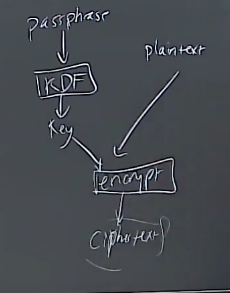
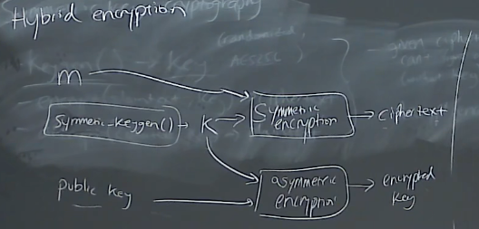

[toc]

# Security and Cryptography

### Entropy

a measure of randomness

### Hash function

maps a variable amount of data into a fixed size output. 

- non-invertible

- collision resistant，难以找到相同输出的两个输入数据

ex. SHA-1(bytes)->160bits

因此，可以把hash哈希值看作是文件的一种summary总结，一旦文件有一点轻微的变化，hash值也会大相径庭

eg. 验证下载的软件是否正版，比较下载的软件的hash值与官方发布的hash值是否match

#### salt 加盐。。。

进一步改进hash存储密码的安全性

假如存储 hash(password)，还是有可能被hash mapping database对应破解（先存了一堆密码的hash，然后匹配hash，找到密码）

因此，引入salt，加盐。。。产生一个随机数（称为salt），然后存储 salt 和 hash( password + salt )。

e.g.

openssl aes-256-cbc -salt -in xxx.file -out xxx.encrypted.file 

openssl aes-256-cbc -d -in xxx.encrypted.file -out xxx.decrypted.file

### Key Derivation function(KDF)

similar to hash function but slow to compute

慢可以使得brute-force破解的过程更慢

ex. PBKDF2(password based key derivation function 2)

## Encryption and Decryption

### Symmetric key cryptography

- keygen() -> key，这是randomized的，而且entropy 很高，如 AES256
- encrypt( plaintext,key) -> ciphertext
- decrypt( ciphertext,key) -> plaintext

特点：

- given ciphertext, can't figure out plaintext( without key )

  有密文，没有密钥，就无法得到明文

- decrypt( encrypt(m,k), k ) = m

  用密钥解密密文，可以取回明文

### p.s. 使用KDF和encryption加密内容

因为加解密需要一个key，如AES256的key，有256位，如果自己也忘记了key，那加密的内容将无法解密

所以，可以结合KDF，记住一个相对简单的的passphrase，然后通过KDF生成一个key，再用这个key去加密plaintext

每次需要key的时候，就可以通过KDF和passphrase生成

### Asymmetric key cryptography

- keygen() -> ( public key, private key )
- encrypt( plaintext, public key ) -> cipher
- decrypt( cipher, private key ) -> plaintext

注意这里 非对称加密 与 对称加密 加解密用的 key 的区别

非对称的keygen产生了一对公钥和密钥，分别用于加密和解密

#### Sign and Verify 

- sign( message, private key ) -> signature
- verify( message, signature, public key ) -> OK?

特点：

- hard to forge( without private key )
- correct，能够用public key 对 signature进行verify

e.g. RSA

### Key distribution

PGP

key base

a website called keybased.io

### 一些RSA加密的社交软件

signal？

telegram?

### Hybrid encryption

Symmetric en/decryption 比较快

所以可以混合 Asymmetric 和 Symmetric en/decryption进行 加解密操作

symmetric_keygen()产生对称密钥k，用于加密信息message

asymmetric_keygen()产生公钥和私钥，用public key加密 对称密钥 k发送给对方，对方用private key私钥解密得到对称密钥k，

随后二者用对称密钥k通信即可，

 